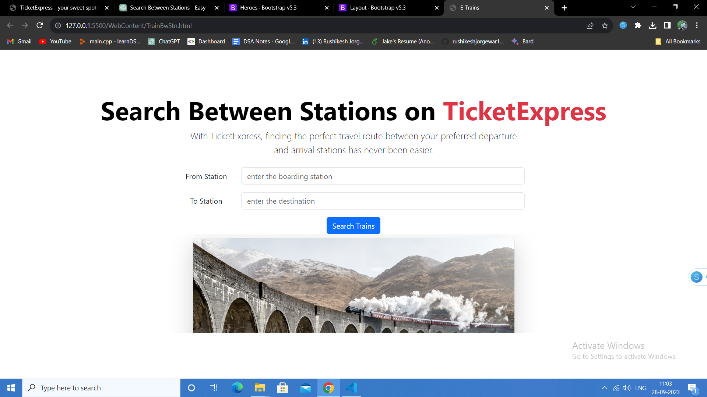

# Train Ticket Reservation System 
<!-- - Youtube video for local setup of similar project: https://www.youtube.com/watch?v=mLFPodZO8Iw -->
- Youtube video for Step by Step Guide on Local Setup: https://www.youtube.com/watch?v=Wd2GlEJJJlw
<!-- - Live Url: https://traintickets.herokuapp.com <br>  -->
<!-- - Login Credentials: admin/admin -->

### About:
This project is about the Train-Ticket-Reservation-System which is used to view Train Schedule, search trains, Seat availability, Train timings. We can also enquire about fare of different trains. We can get information about train between two stations. We can book seats online. This provides a safe and secure seat reservation system. 

### Online Train Information and Reservation
<span style="color:blue">**This Website is built for following purpose:-**</span>
- View Trains Schedule
- Search Trains
- Seat Availability
- Train Timings
- Fare Enquiry
- Trains Between Stations
- Booking seats online.
- Login and Logout Security
- Password Changes
- Payment Gateway
- Ticket Booking History

<span style="color:blue">**The Admin have the following access to this website:-**</span>
- Login
- Add Trains
- Update Trains
- Remove  or cancle Trains
- View Trains
- Profile Edit
- Logout

<span style="color:blue">**The Users have the following Access:-**</span>
- Register
- Login
- View Trains
- Check Seat Availability
- Search Trains
- Train Avaiablity and Fare Between Stations
- Books Tickets
- View Booking History
- View Profile
- Update Profile
- Change Password
- Logout

### Technologies used:-
1. Front-End Development:
- HTML
- CSS
- Bootstrap

2. Back-End Development
- Java [J2EE]
- JDBC
- Servlet
- Oracle ( SQL )

### ==== Software And Tools Required ======
- : Git [https://www.youtube.com/watch?v=gv7VPQ4LZ7g]
- : Java JDK 8+ [https://www.youtube.com/watch?v=O9PWH9SeTTE]
- : Eclipse EE [https://www.youtube.com/watch?v=8aDsEV7txXE]

### ========== Dummy Database Initialization ===========

STEP 1: Open SQL Plus OR SQL Developer

STEP 2: Login and connect to database using administrator username and password

STEP 3 :Execute the below command first to create a new user:

```SQL

ALTER SESSION SET "_ORACLE_SCRIPT"=TRUE;  
CREATE USER RESERVATION IDENTIFIED BY MANAGER;
GRANT DBA TO RESERVATION;
COMMIT;

```
NOTE: If the above command fails for alter session issues, try to remove first line and then execute it.

STEP 4: Now execute the below sql query in same terminal

```SQL

CONNECT RESERVATION/MANAGER;
CREATE TABLE "RESERVATION"."CUSTOMER" 
(	
"MAILID" VARCHAR2(40) PRIMARY KEY, 
"PWORD" VARCHAR2(20) NOT NULL, 
"FNAME" VARCHAR2(20) NOT NULL, 
"LNAME" VARCHAR2(20), 
"ADDR" VARCHAR2(100), 
"PHNO" NUMBER(12) NOT NULL
);

CREATE TABLE "RESERVATION"."ADMIN"
(	
"MAILID" VARCHAR2(40) PRIMARY KEY, 
"PWORD" VARCHAR2(20) NOT NULL, 
"FNAME" VARCHAR2(20) NOT NULL, 
"LNAME" VARCHAR2(20), 
"ADDR" VARCHAR2(100), 
"PHNO" NUMBER(12) NOT NULL
);


CREATE TABLE "RESERVATION"."TRAIN" 
(	
"TR_NO" NUMBER(10) PRIMARY KEY, 
"TR_NAME" VARCHAR2(70) NOT NULL, 
"FROM_STN" VARCHAR2(20) NOT NULL, 
"TO_STN" VARCHAR2(20) NOT NULL, 
"SEATS" NUMBER(4) NOT NULL, 
"FARE" NUMBER(6,2) NOT NULL 
);

CREATE TABLE "RESERVATION"."HISTORY" 
(	
"TRANSID" VARCHAR2(36) PRIMARY KEY, 
"MAILID" VARCHAR2(40) REFERENCES "RESERVATION"."CUSTOMER"(MAILID), 
"TR_NO" NUMBER(10),
"DATE" DATE,
"FROM_STN" VARCHAR2(20) NOT NULL, 
"TO_STN" VARCHAR2(20) NOT NULL, 
"SEATS" NUMBER(3) NOT NULL, 
"AMOUNT" NUMBER(8,2) NOT NULL
);

COMMIT;

INSERT INTO RESERVATION.ADMIN VALUES('rjorgewar@demo.com','rjorgewar','Rushikesh','Jorgewar','Ramnagar, Civil Line, Chandrapur','7020507979');
INSERT INTO RESERVATION.CUSTOMER VALUES('rushikesh@demo.com','rushikesh','Rushikesh','Jorgewar','Chandrapur, Maharashtra',7020507979);

INSERT INTO RESERVATION.TRAIN VALUES(10001,'VANDE BHARAT EXP','BALLARSHAH','PUNE', 152, 490.50);
INSERT INTO RESERVATION.TRAIN VALUES(10002,'YAMUNA EXP','GAYA','DELHI', 52, 550.50);
INSERT INTO RESERVATION.TRAIN VALUES(10003,'NILANCHAL EXP','GAYA','HOWRAH', 92, 451);
INSERT INTO RESERVATION.TRAIN VALUES(10004,'JAN SATABDI EXP','RANCHI','PATNA', 182, 550);
INSERT INTO RESERVATION.TRAIN VALUES(10005,'GANGE EXP','MUMBAI','KERALA', 12, 945);
INSERT INTO RESERVATION.TRAIN VALUES(10006,'GARIB RATH EXP','INDORE','HYDERABAD', 1, 1450.75);
INSERT INTO RESERVATION.TRAIN VALUES(10007,'VIDARBHA EXP','NAGPUR','PUNE', 152, 490.50);
INSERT INTO RESERVATION.TRAIN VALUES(10008,'CHANDA EXP','BALLARSHAH','MUMBAI', 152, 490.50);

INSERT INTO RESERVATION.HISTORY VALUES('BBC374-NSDF-4673','rushikesh@demo.com',10001,TO_DATE('02-FEB-2024'), 'BALLARSHAH', 'PUNE', 2, 981);
INSERT INTO RESERVATION.HISTORY VALUES('BBC375-NSDF-4675','rushikesh@demo.com',10004,TO_DATE('12-JAN-2024'), 'RANCHI', 'PATNA', 1, 550);
INSERT INTO RESERVATION.HISTORY VALUES('BBC373-NSDF-4674','rushikesh@demo.com',10008,TO_DATE('22-JULY-2024'), 'BALLARSHAH', 'MUMBAI', 3, 4352.25);

COMMIT;
```
STEP 5: Now Execute the below query one by one to check if the tables are created successfully
```SQL
SELECT * FROM ADMIN;
SELECT * FROM CUSTOMER;
SELECT * FROM TRAIN;
SELECT * FROM HISTORY;


### The Screenshots of some of the  webPages of this project are Here:

1. Login Page


2. Search Trains Between Stations


3. Book Trains


4. Seat Availability


5. Get Fare


#### "Suggestion and Improvements are Invited"
####  Rushikesh Jorgewar
##### 
